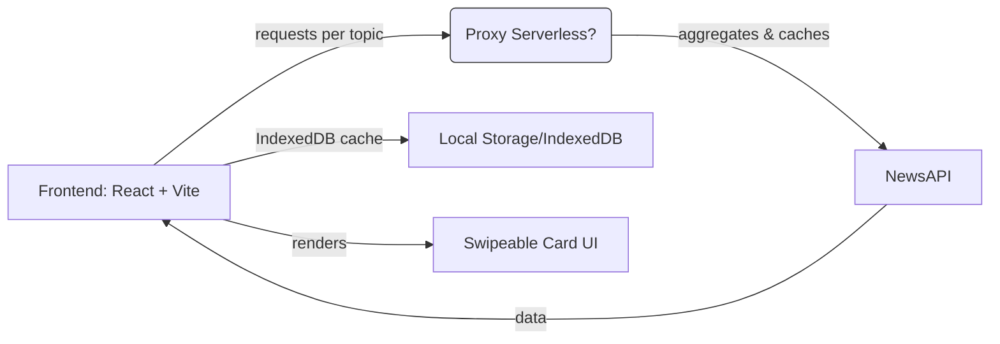

# System Architecture — News App

**Last Updated**: 2025-12-15
**Owner**: Architect agent

## Purpose
High-level architecture for the News App MVP (swipe-first, card-based news feed). This document captures components, runtime flows, quality attributes, and recent architectural decisions.

## Changelog
| Date | Change | Rationale |
|------|--------|-----------|
| 2025-12-15 | Initial architecture and findings added | Align design with roadmap and plan; record required changes before implementation |

---

## High-Level Overview
The News App is a mobile-first single-page web application. Primary responsibilities:
- Present a swipeable card feed of news articles
- Allow user-selected topic & location preferences
- Integrate with NewsAPI (free-tier) with a single-request-per-topic fetch strategy
- Cache results for offline and rate-limit resilience

Core runtime components:
- Frontend (React + Vite) — UI, gestures, preferences, local cache (IndexedDB)
- Optional Serverless Proxy (recommended for production) — API key protection, server-side caching, request aggregation
- External NewsAPI service — authoritative article metadata and links

---

## Component Responsibilities
- Frontend (React+Vite)
  - UI rendering, gestures, preferences UI
  - Local persistence (IndexedDB/localStorage)
  - Fetch orchestration: perform one request per user-selected topic on load/refresh
  - Deduplication by article URL
  - Error classification and user-facing fallbacks

- Serverless Proxy (recommended for production)
  - Hide NewsAPI key
  - Aggregate and cache topic requests to reduce call volume
  - Add simple rate-limit guards and monitoring

- External: NewsAPI
  - Supplies headlines and article metadata

---

## Runtime Flow (summary)
1. User opens app → frontend loads persisted preferences.
2. Frontend issues one NewsAPI request per selected topic (or invokes proxy endpoint that aggregates).
3. Results aggregated, deduplicated, stored in IndexedDB, and rendered as swipeable cards.
4. Background refresh updates cache (respecting single-request-per-topic policy) and notifies UI when new items available.
5. When rate-limited, UI serves cached data and shows clear messaging.

---

## Quality Attributes & Non-Functional Concerns
- Security: Do not embed NewsAPI key in public builds. Use serverless proxy for production.
- Reliability: Cache headlines for 24 hours; show cached content when offline or rate-limited.
- Performance: Minimize requests (single request per topic), aggregate responses, and page results in-band.
- Observability: Track swipes, double-tap opens, preference changes, and API errors.
- Accessibility: Provide keyboard/tap fallbacks for gestures.

---

## Architectural Decisions (Summary)
- Decision: Use React + Vite for frontend (selected by Planner/PM).
- Decision: Free-tier NewsAPI with single-request-per-topic strategy for MVP.
- Decision: Use local IndexedDB for caching; prefer serverless proxy in production to protect key and enable shared caching.

---

## Required ADRs / Action Items (before production deploy)
- ADR: Serverless Proxy — define contract, cache TTLs, rate-limit policy, authentication for internal use.
- ADR: Caching Policy — TTL, eviction, deduplication strategy, offline retention (24h requirement).
- ADR: Error & Backoff Policy — classify NewsAPI errors and define backoff/UX flows.

---

## Mermaid Diagram

---

## Notes
- Verdict: Implementation may proceed, but the following are REQUIRED before production deployment: serverless proxy ADR (or an explicit acceptance of key exposure risk), caching policy, and monitoring plan for API errors and quota exhaustion.
